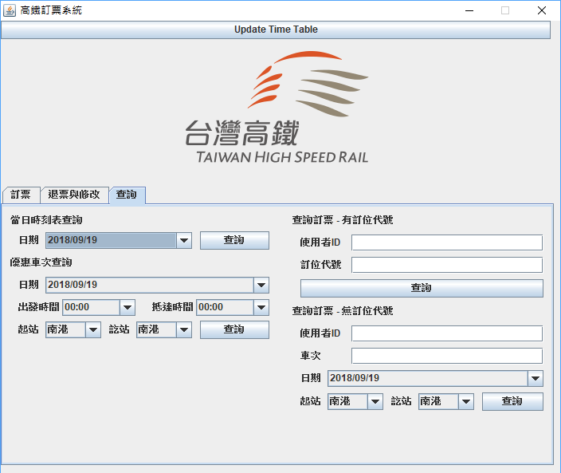

# OOP Final Project 2018
#### Environment

* MySQL 5.7 @ 127.0.0.1:3306
* JDK  1.8.0
* Ecplise Oxygen

#### Dependency

* json-20180130.jar
* jsoup-1.11.3.jar
* mysql-connector-java-8.0.11.jar

```
All of the above jars are in "official jar/"
```

#### Usage

* Import database

  ```mysql
  create database oop_finalproject_assigned;
  use oop_finalproject_assigned;
  source oopFinal.sql;
  ```

* Use Eclipse to open the project.

* Run MainPage.java to start the application.





#### BUG

* All the Chinese character are encoded in BIG-5.